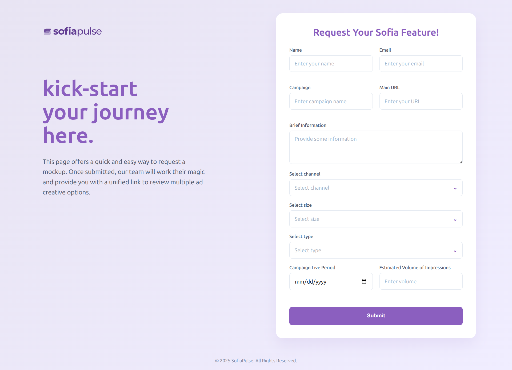

# Joe Form

An elegant and responsive **feature request form** built with **HTML, CSS, and JavaScript**, designed for marketing teams and campaigns. This project includes a modern UI, dropdown selectors, validations, and seamless integration with **n8n webhooks** for handling form submissions.

 <!-- (optional: add a screenshot of your form UI here) -->

---

## 🚀 Features

* 🎨 **Modern Responsive UI** – Fully mobile-friendly layout with a gradient background and styled components.
* 📝 **Custom Form Fields** – Collects name, email, campaign details, URLs, and brief info.
* ✅ **Single-Select Dropdowns** – Styled dropdowns for channel, size, and type selections.
* 📅 **Campaign Fields** – Date picker and estimated volume inputs.
* 🔄 **Webhook Integration** – Submits form data to an external webhook (n8n).
* ⚡ **Success/Error Handling** – Shows friendly messages on submission result.

---

## 📂 Project Structure

```bash
Joe-Form/
├── index.html   # Main HTML file with embedded CSS & JS
├── README.md    # Project documentation
```

---

## 🛠️ Installation & Usage

1. Clone the repo:

   ```bash
   git clone https://github.com/alihassanml/Joe-Form.git
   cd Joe-Form
   ```

2. Open the project:

   ```bash
   # Simply open index.html in your browser
   ```

3. Customize webhook URL (if needed):

   * Find the following line in **index.html**:

     ```javascript
     const response = await fetch('https://jokra.app.n8n.cloud/webhook/e5e222f8-d20f-458d-8d30-d3540199b22e', {
     ```
   * Replace it with your webhook endpoint.

---

## 📸 Demo

👉 [Live Demo (if hosted)](https://your-demo-link.com)
*(Replace with your actual demo link if you deploy it)*

---

## 🤝 Contributing

1. Fork this repo.
2. Create a new branch (`feature-new`).
3. Commit your changes.
4. Push the branch and open a Pull Request.

---

## 📜 License

This project is licensed under the **MIT License** – free to use, modify, and distribute.

---

Would you like me to also create a **short tagline** (2–3 lines) for the top of your README that makes it look more like a startup project landing page? Something like a punchy one-liner for first impressions.
